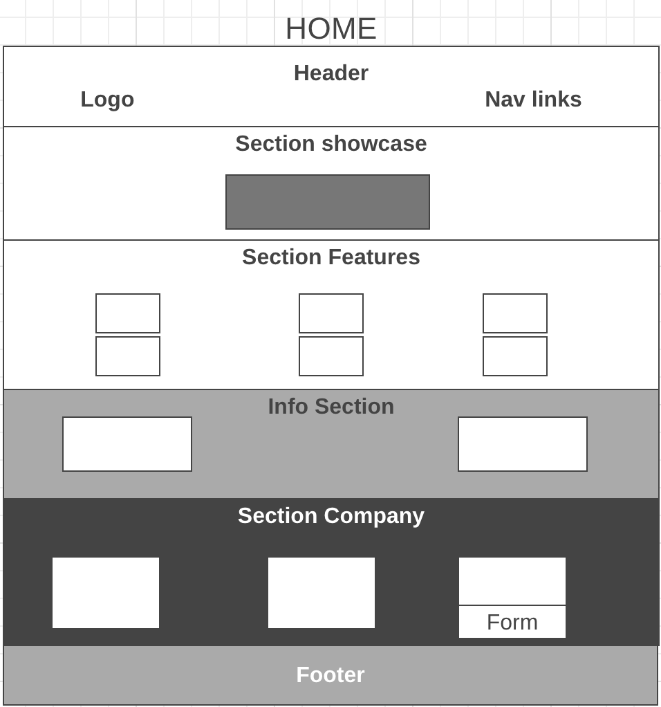

# Development Strategy

> `App-theme`

* `App-theme` was recreate only for learning purpose and was based on Travesy's Media tutorial.

* This is a great template of website, built with HTML5, CSS3 and Flexboxgrid.

* The main idea of ​​the project is the practice of collaboration on GitHub, based on `Git Workflow for Two`. 

## Wireframe

<!-- include a wireframe for your project in this repository, and display it here -->
<!-- wireframe.cc is a good site for getting started with wireframes -->

## 0. Set-Up

_A User can see my initial repository and live demo_

### Repo

- Generate from Template
- Write initial, basic README
- Write the development-strategy file
- Turn on GitHub Pages

## 1. Title 

_As a site visitor, I want to know what the web page is called and to be able to discover the website._

### Repository & Issue

1. This user story was developed locally on a brach called `title`.
1. `Issue # 1` was raised with details how to complete this work .
1. After the whole changes on the current branch, the commit was linked to an existing issue by typing `Closes gh-1`. 
1. A pull request was made to `master`.
1. Changes were merged to `master`.

### HTML

- A `header` element with a title, describing the web page.
- A `nav` element with list of navigation links `Home`, `About`, `Services`,`Contact`.
- A pleasant `footer` element with copyrights.

### CSS

- Layout styling for the header & footer.
- Layout styling for the navigation menu.

## 2.  Greeting

_As a site visitor, I want to see a greeting with a describtion of the web page_

### Repository & Issue

1. This user story was developed locally on a brach called `introduction`.
1. `Issue # 2` was raised with details how to complete this work .
1. After the whole changes on the current branch, the commit was linked to an existing issue by typing `Closes gh-2`. 
1. A pull request was made to `master`.
1. Changes were merged to `master`.

### HTML

- A `showcase` section element with a greeting and description of the web page.

### CSS

- Layout styling for the `showcase` section.
- Styling the showcase content and applying a nice background picture.
- Applying `media queries` to enable webpage content to adapt to different screen sizes and resolutions.

## 3.  Features

_As a site visitor, I want to know what features the company offers_

### Repository & Issue

1. This user story was developed locally on a brach called `features`.
1. `Issue # 3` was raised with details how to complete this work .
1. After the whole changes on the current branch, the commit was linked to an existing issue by typing `Closes gh-3`. 
1. A pull request was made to `master`.
1. Changes were merged to `master`.

### HTML

 - A `features` section element with the core features of the company.
 - The icon elements were added to convey the purpose of the features.  

### CSS

- Layout styling for the `features` section.
- Styling the icons for the features.

## 4.  Info

_As a site visitor, I want to know more additional information about the core features, that company offers._

### Repository & Issue

1. This user story was developed locally on a brach called `info`.
1. `Issue # 4` was raised with details how to complete this work .
1. After the whole changes on the current branch, the commit was linked to an existing issue by typing `Closes gh-4`. 
1. A pull request was made to `master`.
1. Changes were merged to `master`.

### HTML

 - `Info` section element with the list of additional core features of the company.
 - Applying the image of the iPhone to capture the attention of the visitor.

### CSS

- Layout styling for the `info` section.
- Applying nice background picture for the `info` section.
- Styling the list of the core features.

## 5.  Company

_As a site visitor, I want to know how can I contact the company, some information about the company itself, and want to subscribe to their newsletter._

### Repository & Issue

1. This user story was developed locally on a brach called `company`.
1. `Issue # 5` was raised with details how to complete this work .
1. After the whole changes on the current branch, the commit was linked to an existing issue by typing `Closes gh-5`. 
1. A pull request was made to `master`.
1. Changes were merged to `master`.

### HTML

 - `Company` section element with the list of ways to contact the company.
 - `About us` paragraph with short information about company.
 - A form for subscribing to the users for the newsletter of the company. 

### CSS

- Layout styling for the `company` section.
- Pleasant design of company contacts.
- Styling a form to attract users to a newsletter subscription.

## 6. About us

_As a site visitor, I want to know more full information about the company, who they are and what they are doing._

### Repository & Issue

1. This user story was developed locally on a brach called `about_us`.
1. `Issue # 6` was raised with details how to complete this work .
1. After the whole changes on the current branch, the commit was linked to an existing issue by typing `Closes gh-6`. 
1. A pull request was made to `master`.
1. Changes were merged to `master`.

### HTML

 - `About`page with the same header, footer and company section, to keep the whole web site in one pleasant style.
 - `Subheader` to grab the visitor's attention.
 -  A paragraph `Who We Are` with full description of company.
 -  A paragraph `What We Do` with full description what the company actually doing.

### CSS

- We can apply already existing styling for the main elements for the `About` page.
- Applying the margin-bottom in order to add more space between two paragraphs. 

## 7. Services

_As a site visitor, I want to know more full information about services, that company  offers._

### Repository & Issue

1. This user story was developed locally on a brach called `services`.
1. `Issue # 7` was raised with details how to complete this work .
1. After the whole changes on the current branch, the commit was linked to an existing issue by typing `Closes gh-7`. 
1. A pull request was made to `master`.
1. Changes were merged to `master`.

### HTML

 - `Services`page with the same header, footer and company section, to keep the whole web site in one pleasant style.
 - `Subheader` to grab the visitor's attention.
 - A full list of what exactly the company offers for users.

### CSS

- We can apply already existing styling for the main elements for the `services` page.
- Applying the nice  styling and background for the list of services.

## 8. Contact

_As a site visitor, I want to be able to be in touch and to have the opportunity to contact the company by email._

### Repository & Issue

1. This user story was developed locally on a brach called `contact`.
1. `Issue # 8` was raised with details how to complete this work .
1. After the whole changes on the current branch, the commit was linked to an existing issue by typing `Closes gh-8`. 
1. A pull request was made to `master`.
1. Changes were merged to `master`.

### HTML

 - `Contact`page with the same header, footer and company section, to keep the whole web site in one pleasant style.
 - `Subheader` to grab the visitor's attention.
 - A form to provide the opportunity for users  to contact the company by email

### CSS

- We can apply already existing styling for the main elements for the `contact` page.
- Styling the form to provide users convenient and easy way to contact the company by email.

## 9. Finishing Touches

### Repository & Issue

1. This user story was developed locally on a brach called `corrections`.
1. `Issue # 9` was raised with details how to complete this work .
1. After the whole changes on the current branch, the commit was linked to an existing issue by typing `Closes gh-9`. 
1. A pull request was made to `master`.
1. Changes were merged to `master`.

- A complete README:
  - [makeareadme.com](https://www.makeareadme.com/)
  - [bulldogjob](https://bulldogjob.com/news/449-how-to-write-a-good-readme-for-your-github-project)
  - [meakaakka](https://medium.com/@meakaakka/a-beginners-guide-to-writing-a-kickass-readme-7ac01da88ab3)
- Validate code to check for any last mistakes
